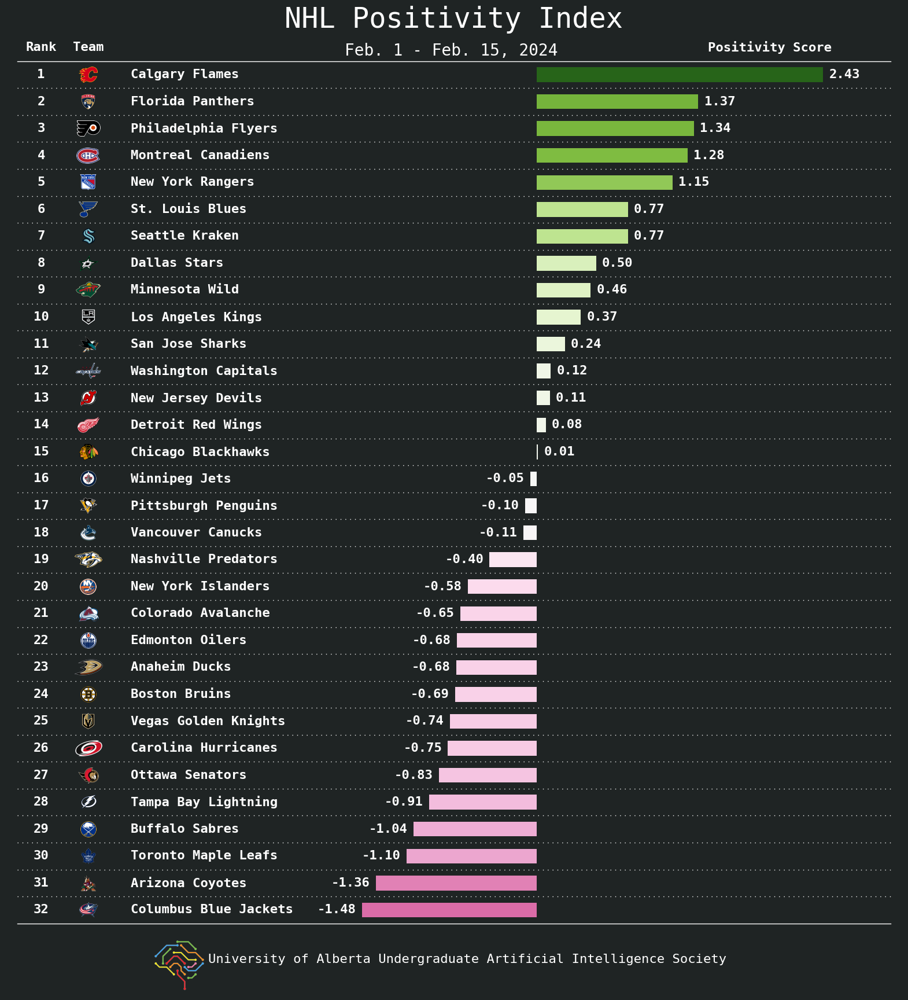
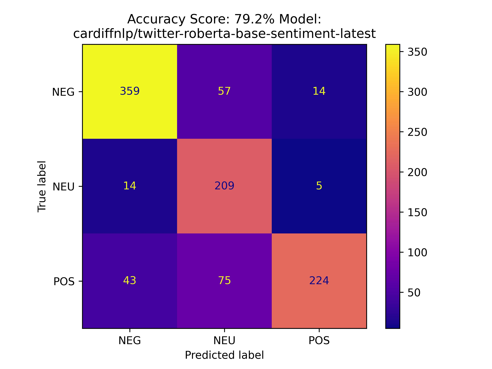
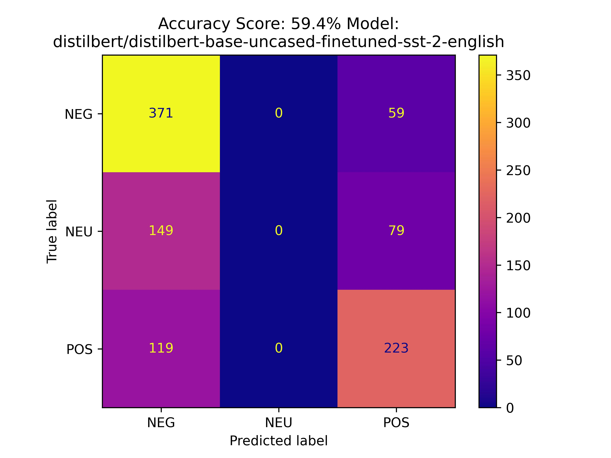
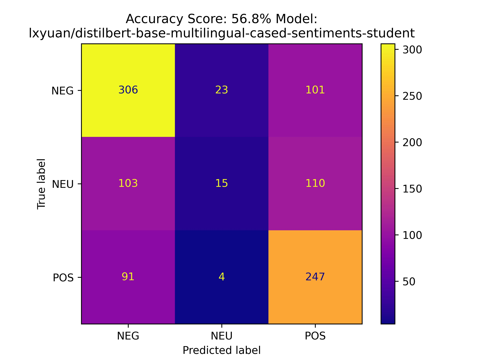
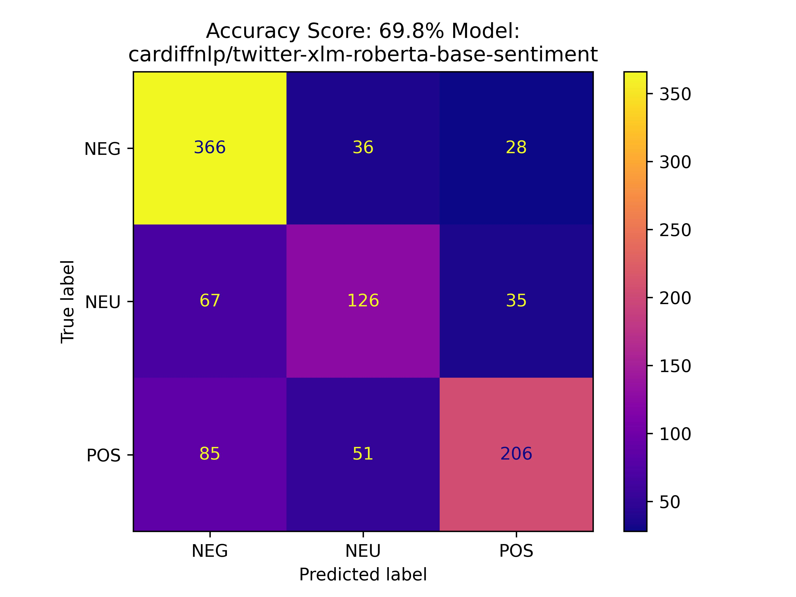
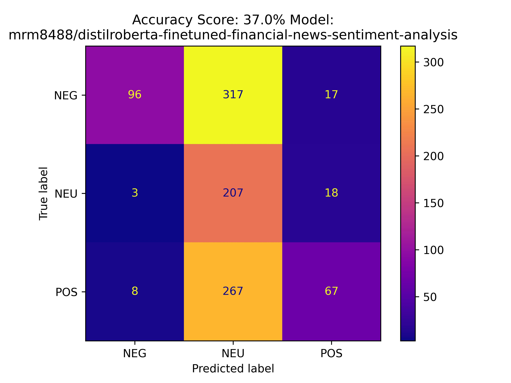
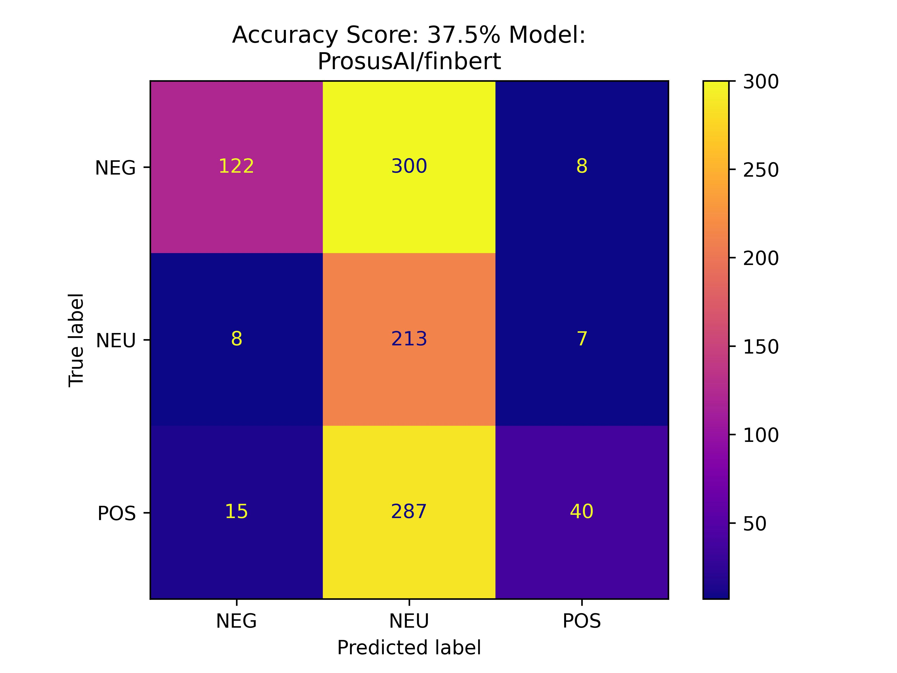
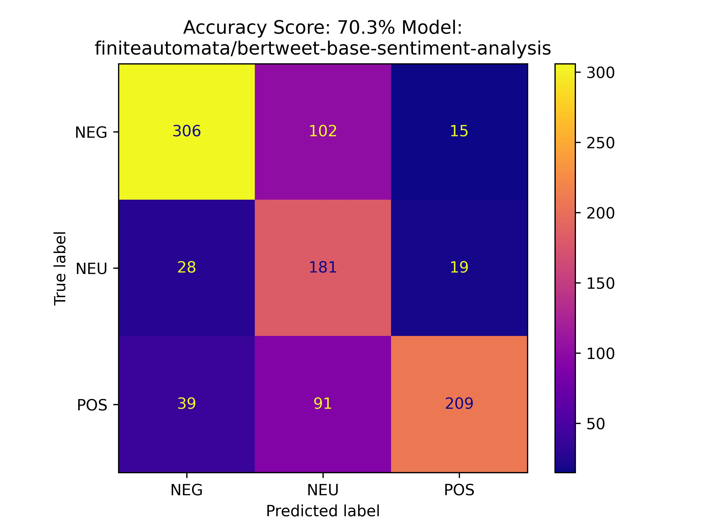

<h1 style="text-align: center;">NHL Positivity Index</h1>

We were inspired by the engaging and insightful ["Panic Index"](https://www.youtube.com/playlist?list=PL4KmQCGTJmgz9urZusFDiGC9Bzh2S67gM) series by YouTuber Shannon Skanes, also known as the Hockey Guy, where he ranks NHL teams based on their perceived level of panic at key moments throughout the season. Intrigued by this unique perspective on team performance, we wondered: Could we quantify the underlying sentiment of NHL fanbases in a similar vein? Thus, the NHL Positivity Index was born. Our project aims to quantitatively assess how positive or negative an NHL fanbase feels over a given period using artificial intelligence techniques. Specifically, we leverage natural language processing and sentiment analysis to analyze fan discussions and media commentary. By dissecting the tone and mood from Reddit, we seek to provide a comprehensive measure of fanbase sentiment. This endeavor not only offers insights into the impact of team performance on fans but also explores the broader emotional landscape of sports fandom. Join us as we delve into the heart of NHL fan sentiment, exploring the highs and lows through the lens of data and AI.

## The Team

The NHL Positivity Index was created by the Undergraduate Artificial Intelligence Society at the University of Alberta in Edmonton, Alberta, Canada. The team consisted of:

- Jacob Winch, Statistics Student | [Linkedin](https://www.linkedin.com/in/jacob-winch/)
- Tanmay Munjal, Computer Science & Physics Student | [Linkedin](https://www.linkedin.com/in/tanmaymunjal/)
- Heiby Lau, Computer Science Student | [Linkedin](https://www.linkedin.com/in/heiby-lau/)
- Alexander Bradley, Computer Engineering Student | [Linkedin](https://www.linkedin.com/in/alexander-bradl3y/)
- Arden Monaghan, Computer Science Student | [Linkedin](https://www.linkedin.com/in/arden-monaghan-574959243/)
- Yukesh Subedi, Computer Science Student | [Linkedin](https://www.linkedin.com/in/yukesh-subedi-392872218/)
- Taran Purewal, Computer Science Student | [Linkedin](https://www.linkedin.com/in/tpurewal/)
- William Luo, Electrical Nano-Engineering Student | [Linkedin](https://www.linkedin.com/in/william-luo-5a477421b/)

We would like to extend a gracious thank you to the Student Innovation Centre at the University of Alberta for providing the team a place to work every week.

## The Data

The data is collected from Reddit. We extract comments from each NHL team’s subreddit.  In particular, we extracted comments from the game day, pre-game, and post-game threads or threads of similar nature in each team’s subreddit. We did this to try and ensure that we have similar data from every team in the NHL. We also felt that posts under the pre-, post-, and game-day threads were the most authentic way to gauge general fan sentiment. Most threads are posted by the user **u/HockeyMod**. For teams that don’t have the game threads posted by **u/HockeyMod**, there were ways to extract the game threads. For example, teams like the Edmonton Oilers or the Boston Bruins use flairs to mark the posts, teams like the Winnipeg Jets or the Tampa Bay Lightning use a standardized title and teams like the Anaheim Ducks or the Detroit Redwings have a designated user that posts the threads, such as user **u/dahooddawg** for the Anaheim Ducks and user **u/OctoMod** for the Detroit Red Wings. To extract the comments we used [PRAW](https://praw.readthedocs.io/en/stable/), Python’s Reddit API Wrapper.

## Data Labelling Process

For the data used in the dashboard, we first collect all the comments in relevant threads during two weeks for each NHL team and write them in a .json file. then we run the file through the [**cardiffnlp/twitter-roberta-base-sentiment-latest**](https://huggingface.co/cardiffnlp/twitter-roberta-base-sentiment-latest) model to get the label and the score for each comment.  The labels for each comment are either **positive**, **neutral**, or **negative**.  We then plug each labelled comment into our positivity score formula which can be seen below. 

## Positivity Score

The positivity score for team j, $PS(T_{j})$, is defined as:

$$
PS(T_j) = \frac{1}{n_j} \sum_{i=1}^{n_j} L(x_{ij}) \cdot (S(x_{ij}) + 1)
$$

Where:
- $j$ is the index of an NHL team, $j = 1, 2, \ldots, 32$
- $i$ is the index of a comment, $i = 1, 2, \ldots, n_j$
- $n_j$ is the number of comments for team $j$
- $T_j$ represents team $j$
- $x_{ij}$ is the $i^{th}$ comment of team $j$
- $L(x_{ij})$ is the sentiment label mapping for comment $x_{ij}$
- $S(x_{ij})$ is the score for each comment (number of upvotes)

The sentiment label mapping, $L(x_{ij})$, is defined as a piecewise function:

$$
L(x_{ij}) = 
\begin{cases} 
1 & \text{if } x_{ij} \text{ is positive}, \\
0.25 & \text{if } x_{ij} \text{ is neutral}, \\
-1 & \text{if } x_{ij} \text{ is negative}. 
\end{cases}
$$

We added + 1 to every score to avoid multiplying by 0. We also took the average positivity score so we can compare positivity scores from different periods. We are mapping 0.25 for neutral comments so we still include neutral comments and to balance the distribution of negative and postivite comments.

## Evaluation of different models

We tested seven pre-trained NLP models from Hugging Face. For evaluating the different models, each team member manually labelled a dataset with 1000 comments and compared the model’s predictions against our labels. Each model was tested with the [**NHL-SentiComments-1K-TEST**](https://github.com/UndergraduateArtificialIntelligenceClub/NHL-Positivity-Index/blob/main/data/training_data/NHL-SentiComments-1K-TEST.json) dataset. From this analysis, we selected the [**cardiffnlp/twitter-roberta-base-sentiment-latest**](https://huggingface.co/cardiffnlp/twitter-roberta-base-sentiment-latest) model due to its strong performance. Below you can see the performance of each model:

We tested the following 7 models:

- [**cardiffnlp/twitter-roberta-base-sentiment-latest**](https://huggingface.co/cardiffnlp/twitter-roberta-base-sentiment-latest)
- [**Distilbert-base-uncased-finetuned-sst-2-english**](https://huggingface.co/distilbert/distilbert-base-uncased-finetuned-sst-2-english)
- [**lxyuan/distilbert-base-multilingual-cased-sentiments-student**](https://huggingface.co/lxyuan/distilbert-base-multilingual-cased-sentiments-student)
- [**cardiffnlp/twitter-xlm-roberta-base-sentiment**](https://huggingface.co/cardiffnlp/twitter-xlm-roberta-base-sentiment)
- [**mrm8488/distilroberta-finetuned-financial-news-sentiment-analysis**](https://huggingface.co/mrm8488/distilroberta-finetuned-financial-news-sentiment-analysis)
- [**ProsusAI/finbert**](https://huggingface.co/ProsusAI/finbert)
- [**finiteautomata/bertweet-base-sentiment-analysis**](https://huggingface.co/finiteautomata/bertweet-base-sentiment-analysis)

**Figure 1.1:** *A confusion matrix of the [**cardiffnlp/twitter-roberta-base-sentiment-latest**](https://huggingface.co/cardiffnlp/twitter-roberta-base-sentiment-latest) model’s predicted labels against our labels. The model obtained an accuracy score of 79.2%.*

**Figure 1.2:** *A confusion matrix of the [**Distilbert-base-uncased-finetuned-sst-2-english**](https://huggingface.co/distilbert/distilbert-base-uncased-finetuned-sst-2-english) model’s predicted labels against our labels. The model obtained an accuracy score of 59.4%.*

**Figure 1.3:** *A confusion matrix of the [**lxyuan/distilbert-base-multilingual-cased-sentiments-student**](https://huggingface.co/lxyuan/distilbert-base-multilingual-cased-sentiments-student) model’s predicted labels against our labels. The model obtained an accuracy score of 56.8%.*

**Figure 1.4:** *A confusion matrix of the [**cardiffnlp/twitter-xlm-roberta-base-sentiment**](https://huggingface.co/cardiffnlp/twitter-xlm-roberta-base-sentiment) model’s predicted labels against our labels. The model obtained an accuracy score of 69.8%.*

**Figure 1.5:** *A confusion matrix of the [**mrm8488/distilroberta-finetuned-financial-news-sentiment-analysis**](https://huggingface.co/mrm8488/distilroberta-finetuned-financial-news-sentiment-analysis) model’s predicted labels against our labels. The model obtained an accuracy score of 37.0%.*

**Figure 1.6:** *A confusion matrix of the [**ProsusAI/finbert**](https://huggingface.co/ProsusAI/finbert) model’s predicted labels against our labels. The model obtained an accuracy score of 37.5%.*

**Figure 1.7:** *A confusion matrix of the [**finiteautomata/bertweet-base-sentiment-analysis**](https://huggingface.co/finiteautomata/bertweet-base-sentiment-analysis) model’s predicted labels against our labels. The model obtained an accuracy score of 70.3%.*

## Manual Process of Labelling Data

With the hopes of improving the accuracy of [**cardiffnlp/twitter-roberta-base-sentiment-latest**](https://huggingface.co/cardiffnlp/twitter-roberta-base-sentiment-latest). We manually labelled 6168 comments from December 1st, 2023 to December 15th, 2023 from various NHL team’s subreddits. Unfortunately, we were unsuccessful in finetuning 
[**cardiffnlp/twitter-roberta-base-sentiment-latest**](https://huggingface.co/cardiffnlp/twitter-roberta-base-sentiment-latest) however, the dataset may be useful for future fan analytics projects. The dataset can be found [here](https://www.kaggle.com/datasets/jacobwinch/nhl-reddit-comments).

## Future Work

Some examples of future work can include extending this project to future sports. Additionally, there can be further improvements to our current project such as improving the sentiment analysis model or incorporating more aspects of an NHL team’s subreddit. 

## References 

Skanes, S. [The Hockey Guy]. (n.d.). *Panic Index* [Playlist]. YouTube. Retrieved February 25, 2024, from https://www.youtube.com/playlist?list=PL4KmQCGTJmgz9urZusFDiGC9Bzh2S67gM

Envall, D., & Blåberg Kristoffersson, P. (2022). The buzz behind the stock market: Analysis and characterization of the social media activity around the time of big stock valuation changes.

Barbieri, F., Camacho-Collados, J., Espinosa-Anke, L., & Neves, L. (2020). TweetEval: Unified Benchmark and Comparative Evaluation for Tweet Classification. In *Proceedings of Findings of EMNLP*.

Nguyen, D. Q., Vu, T., & Nguyen, A. T. (2020). BERTweet: A pre-trained language model for English Tweets. arXiv preprint arXiv:2005.10200.

## Codebase 

The codebase for the NHL Positivity index can be found [here](https://github.com/UndergraduateArtificialIntelligenceClub/NHL-Positivity-Index.) 